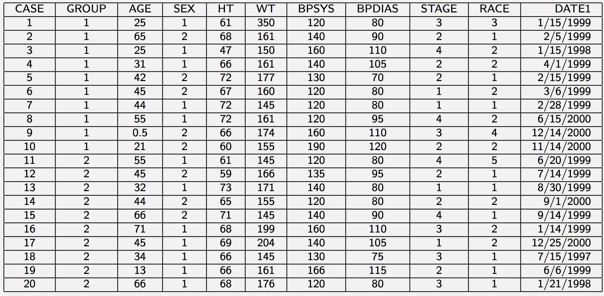
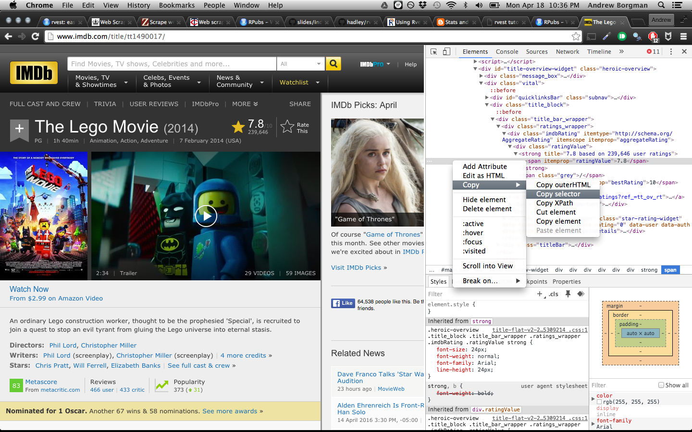
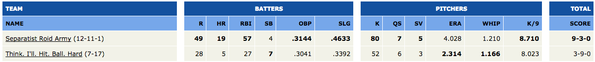
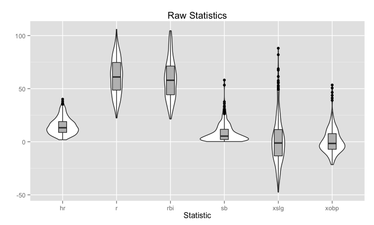
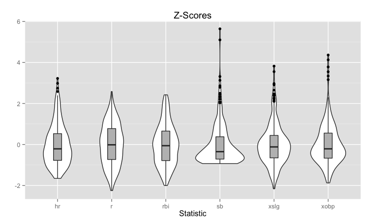
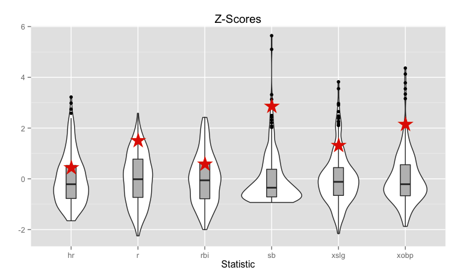
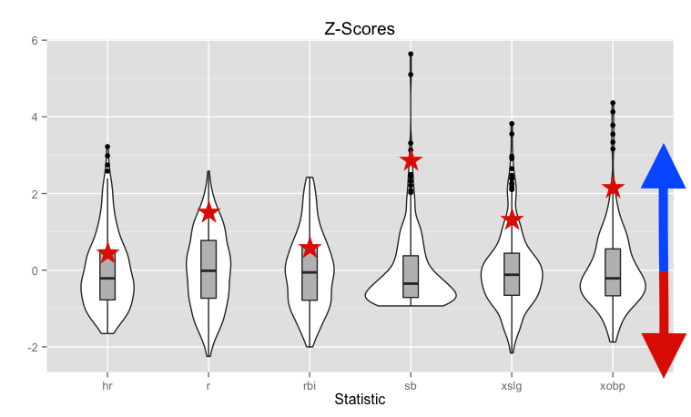
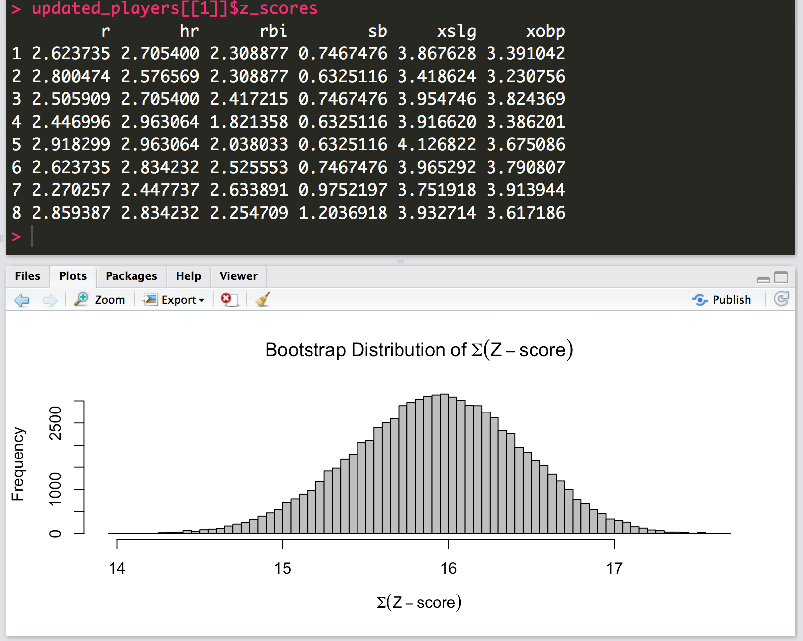
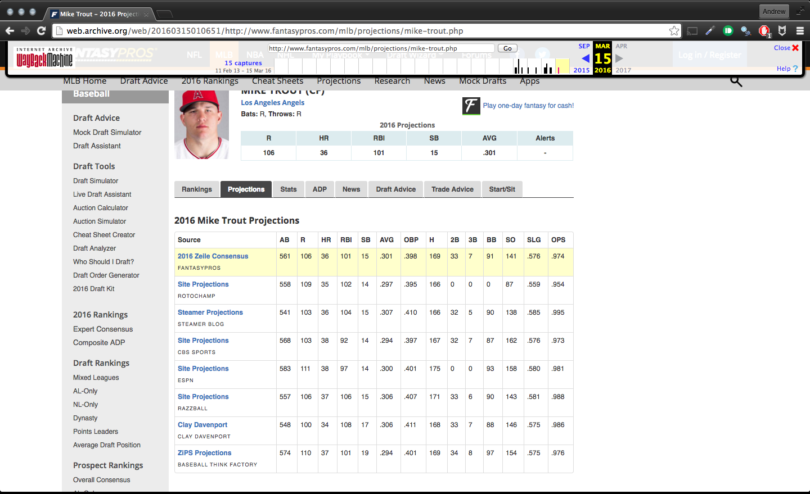
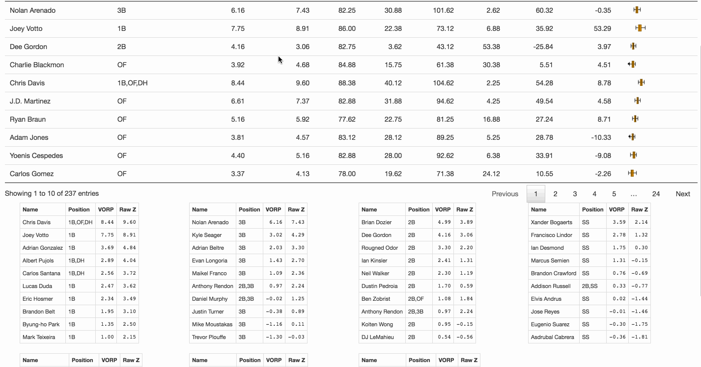

```{r config, include=FALSE}
library(knitr)
library(rvest)
library(humanparser)
opts_chunk$set(message = FALSE, warning = FALSE)
```


## Overview

- Why web scraping?
- Web scraping in `R`
- Use case: Fantasy Baseball Analytics


# Why web scraping?


## All starts with an idea...

<div align = "center">
 
</div>


## So you search for some data

<div align = "center">
 
</div>


## And you (almost) never find this...

<div align = "center">
 
</div>


## If you're lucky...

- Someone has done the hard work for you
- Data is available in aggregated format (text file, DB, etc.)
- Or can be accessed via a standardized API


## But what if you aren't lucky?

<div align = "center">
 
</div>


# Web scraping in `R`

## Many approaches, we'll use `rvest` 

<div align = "center">
 
</div>


## Dummy Example

```{r}
library(rvest)

# Store web url
lego_movie <- read_html("http://www.imdb.com/title/tt1490017/")

#Scrape the website for the movie rating
rating <- lego_movie %>% 
  html_nodes("strong span") %>%
  html_text() %>%
  as.numeric()
rating
```

## Chrome Developer Tools - Your New Best Friend

This is how to figure out what to put in `html_nodes`!

<div align = "center">
 
</div>


## Dummy Example - Continued

```{r}
# Scrape the website for the cast
cast <- lego_movie %>%
  html_nodes("#titleCast > table") %>%
  html_table()
cast
```


# Use case: Fantasy Baseball


## What is Fantasy Baseball?

- 10 teams draft 26 MLB players to create teams 
    - each player can only be on 1 team
- teams compete against one another in head-to-head match-ups each week
- scores are determined based on players performances in different statistical categories during that week

<div align = "center">
 
</div>


## What is Fantasy Baseball?

- 10 teams draft 26 MLB players to create teams (player can only be on 1 team)
- teams compete against one another in head-to-head match-ups each week
- scores are determined based on players performances in different statistical categories during that week

<div align = "center">
 
</div>


<font size="16" color="red">Question: How can we use `R` to help us win our league!?</font>


## Fantasy Baseball Analytics

- With analytics, of course!
- Scrape multiple statistical projections for each player
- **Goal:** Compute value for each player *while accounting for variability in projections*

<div align = "center">
 
</div>

## Estimating Value - Z-Score Approach

Step 1: Compute z-scores of statistics for all players

<div align = "center">
 
</div>


## Estimating Value - Z-Score Approach

Step 2: Compute value as sum of z-scores for each statistic 

<div align = "center">
 
</div>

## Estimating Value - Z-Score Approach

Step 3: Compute player value over replacement (VORP) for each position

<div align = "center">
 
</div>


## Estimating Value - Z-Score Extension

Step 4: Estimate uncertainty using bootstrapping approach

<div align = "center">
 
</div>


## Source of Projections

See an example of the data we want to pull [here](http://web.archive.org/web/20160315010651/http://www.fantasypros.com/mlb/projections/mike-trout.php)


<div align = "center">
 
</div>


## Figuring out Our URL Pattern

- `http://www.fantasypros.com/mlb/projections/mike-trout.php`
- `http://www.fantasypros.com/mlb/projections/bryce-harper.php`
- **`http://www.fantasypros.com/mlb/projections/FIRSTNAME-LASTNAME.php`**


## Getting first and last names for all players

- Use [overall projections](http://www.fantasypros.com/mlb/rankings/overall.php) to obtain player names)

```{r, eval=FALSE}
u <- 'http://www.fantasypros.com/mlb/rankings/overall.php'
fp_overall <- u %>% 
  read_html() %>% 
  html_nodes('.mobile-table .table') %>% 
  html_table() %>% 
  first
```

## Scraping All Projections {.smaller}

```{r, eval=FALSE}
# scrape all the available projections for each player
proj <- lapply(1:nrow(fp_overall), function(i) {
  parsed_name <- parse_name(fp_overall$player[i]) # https://github.com/hrbrmstr/humanparser
  print(parsed_name$fullName)
  tryCatch(
    expr = {
      sprintf('http://www.fantasypros.com/mlb/projections/%s-%s.php', 
                   tolower(gsub("\\.|\\'", '', parsed_name$firstName)), 
                   tolower(parsed_name$lastName)) %>% 
        read_html() %>% 
        html_nodes('.mobile-table .table') %>% 
        html_table() %>% 
        first
    },
    error = function(e) return(NULL)
  )
})
```

## The Final Product

<div align = "center">
 
</div>


# Questions?


